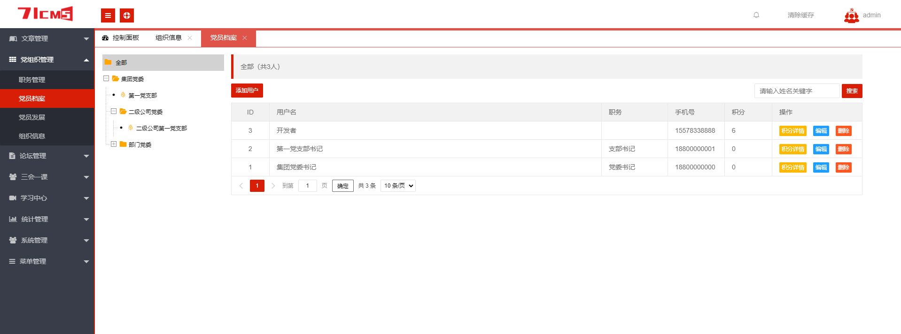
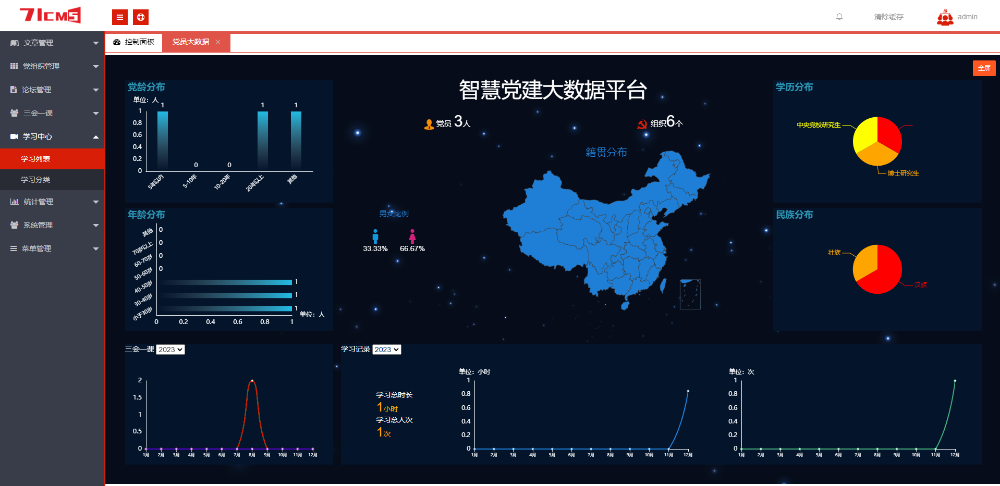
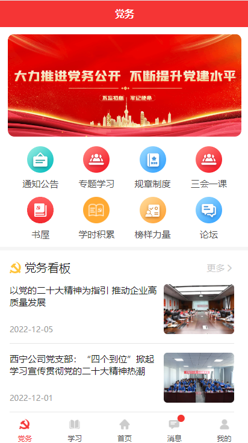
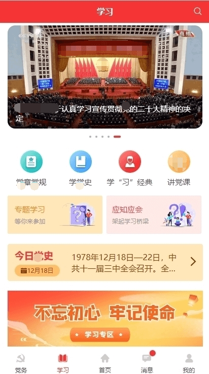
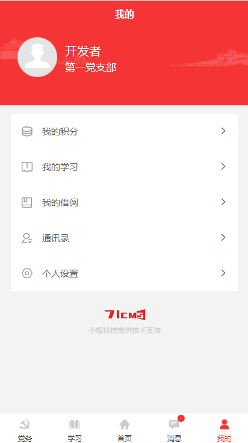
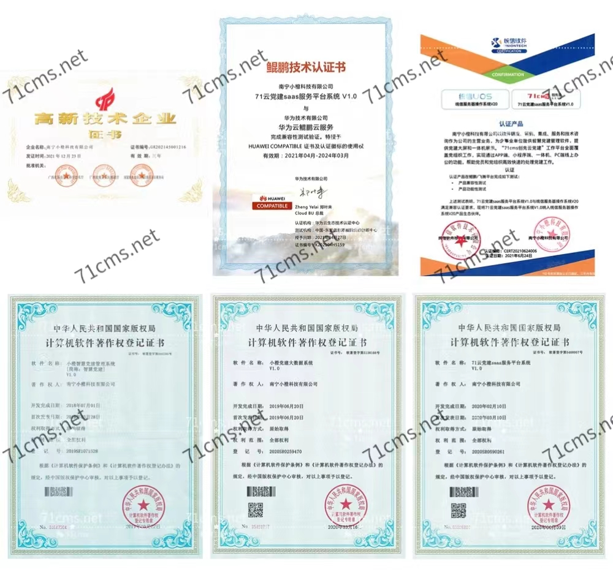

<div align="center" >
    
</div>
<div align="center">

71CMS创先云智慧党建系统开源版

</div>

#### 

<div align="center">

[官网](https://www.71cms.net/) |
[在线体验](https://demo.71cms.net/) |
[帮助文档](https://doc.71cms.net/)

</div>

### 介绍
71CMS创先云党建系统具有与时俱进的开拓性，解决了基层党建宣传难，学习材料传播难，网络不便利，工作环境有限制等困难。 以“互联网+党建”为理念，集成党建核心服务，打破做展板、宣传栏，发放宣传册的传统宣传模式。 通过党建服务一体机以文字、图片、音频、视频、图片、图书等多种展出形式来宣传党的知识、传播党的思想，推动党建工作的信息化、智慧化、数字化，最终实现贯彻学习党的精神、服务党员工作生活、扩大党组织建设的目标。 完善基层党建环境，建设完善的党建场景，在内外部市场前景广阔。

---

### 运行环境

```
Nignx/Apache
PHP 7.1 ~ 7.4 
MySQL 5.7
```
[帮助文档](https://doc.71cms.net/)

###  系统演示


管理后台： http://demo.71cms.net/admin

账号：demo

密码：71cms.net


H5端：http://demo.71cms.net/h5/ （移动端打开）

账号：13888888888

密码：123456

---

###  功能

| 功能    | 说明                    |
|-------|-----------------------|
| 党组织管理 | 党组织结构、管理党组织信息、设置组织管理员 |
| 人员管理  | 导入、编辑管理人员信息           |
| 组织生活  | 发布三会一课，签到、心得          |
| 党建宣传  | 党建资讯、党建热点             |
| 学习教育  | 在线学习，统计学时             |
| 党建工作  | 通知公告，党务公开             |
| 统计管理  | 会议统计、党员画像             |
| ……    | ……                    |
---

###  界面展示

#### 管理端  



#### 移动端  



---
###  软件证书


---
###  商业用途
如果您想基于党建系统进行定制开发，我们提供有偿定制服务支持！
其他合作模式不限，欢迎来撩！  
官网地址：https://www.71cms.net  
联系微信客专业解答

如果您需要Java版本的相关资源、技术支持或定制开发服务，欢迎随时与我联系。我将竭诚为您提供专业的帮助和解决方案  


---
###  特别鸣谢
排名不分先后，感谢这些软件的开发者：ThinkPHP、Layui、VUE、MySQL、uni-app、ECharts等

---

###  使用须知
1、允许用于个人学习、毕业设计、教学案例。

2、商用必须取得版权所有者的授权。

3、禁止将本项目的代码和资源进行任何形式的出售，产生的一切任何后果责任由侵权者自负。

<font color=#FF0000 size=5>4、喜迎七一，现优惠价加微信获取商业授权并附赠手机端源码。</font>

---
###  版权信息

本项目包含的第三方源码和二进制文件之版权信息另行标注。

版权所有Copyright © 2018-2023 by 71CMS (https://www.71cms.net)

All rights reserved。